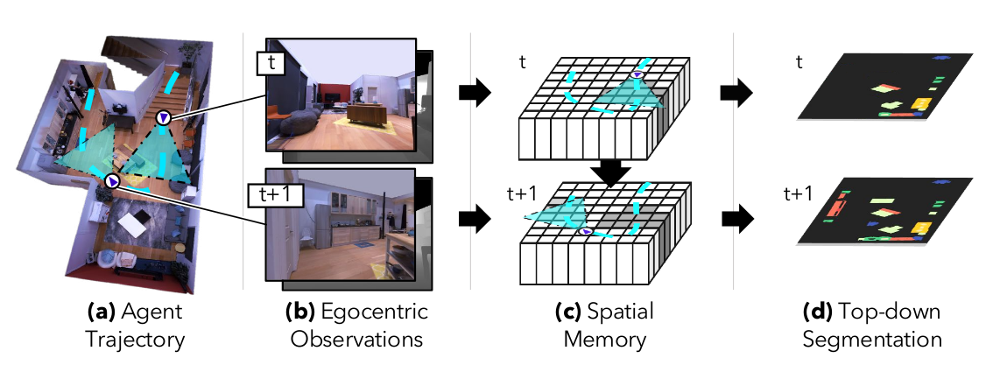

# Semantic-MapNet

Code for the paper:

**[Semantic MapNet: Building Allocentric Semantic Maps and Representations from Egocentric Views][1]**
*Vincent Cartillier, Zhile Ren, Neha Jain, Stefan Lee, Irfan Essa, Dhruv Batra*


Website: [smnet.com][2]

<p align="center">
  
</p>

## Install
The code is tested with Ubuntu 16.04, Python 3.6, Pytorch v1.4+.
 * Install the requirements using pip:

   pip install -r requirements.txt

 * To render egocentric frames in the Matterport3D dataset we use the Habitat simulator. Install [Habitat-sim](https://github.com/facebookresearch/habitat-sim) and [Habitat-lab](https://github.com/facebookresearch/habitat-lab):
 Tested with the following versions Habitat-sim == 0.1.7 and Habitat-lab == 0.1.6.


## Demo
run the following script for demo:

    python demo.py


## Data
 * ```data/paths.json``` has all the manually recorded trajectories.
 * The semantic dense point cloud of objects with cleaned floor labels are available here: https://drive.google.com/drive/folders/1Fwbq7Bvl4kIjJ-YOJNbYWHD_6Gh8lFwQ?usp=sharing. Place those under ```data/object_point_clouds/```. If you are looking to recompute those point clouds you can run ```data/build_point_cloud_from_mesh.py```.
 * Ground truth top-down semantic maps are available here: https://drive.google.com/drive/folders/1aM9vfDckY6K81mrVhVLmEX5rKZ2B1Q5r?usp=sharing. Place those under ```data/semmap/```
 * Place the [Matterport3D](https://niessner.github.io/Matterport/) data under ```data/mp3d/```

## Workflow
 * To recompute the GT topdown semantic maps from the object point clouds (```data/object_point_clouds/```) you can run the following:

        python compute_GT_topdown_semantic_maps/build_semmap_from_obj_point_cloud.py


 * Build training data: (1) build egocentric features + indices, (2) build topdown crops (250x250) (3) preprocess projection indices

        python precompute_training_inputs/build_data.py
        python precompute_training_inputs/build_crops.py
        python precompute_training_inputs/build_projindices.py


 * To train SMNet you can run ```train.py```
 * Precompute testing features and projections indices for the full tours in the test set:


        python precompute_test_inputs/build_test_data.py
        python precompute_test_inputs/build_test_data_features.py


 * To evaluate SMNet you can run ```test.py```


## Pre-trained models
 * pretrained weights are available here: https://drive.google.com/file/d/1KsJoTs91ez2bR35wW1VlD8jBG_gB-k7a/view?usp=sharing
 * pretrained weights for RedNet are available here: https://drive.google.com/file/d/1PZDwl6dmIl6bhmWG42aRGyghgQQWTOcz/view?usp=sharing


## Object-Goal Navigation
 * Download the [ObjectNav-Challenge-data](https://github.com/facebookresearch/habitat-lab) and place it under: ```data/ObjectNav/objectnav_mp3d_v1/val/```
 * Download the precomputed topdown semantic map predictions here: https://drive.google.com/file/d/1wPtJaoDO15OtPcWcXuAbCtGQ3r-MdQM2/view?usp=sharing and place them in ```data/ObjectNav/semmap/```
 * Download the precomputed ObjNav GT goals here: https://drive.google.com/file/d/1Y6Qb6eGryZNkbjWGiqQJE2k-zV0aArrd/view?usp=sharing and place the json file in ```data/ObjectNav/```
 * You can recompute the semantic predictions using the explorations paths in ```data/ObjectNav/paths.json``` and the ```test.py``` script.
 * Compute the freespace maps:

        python ObjectNav/build_freespace_maps.py

 * Run A* path planning:

        python ObjectNav/run_astar_planning.py


## Citation

If you find our work useful in your research, please consider citing:

    @article{cartillier2020semantic,
      title={Semantic MapNet: Building Allocentric SemanticMaps and Representations from Egocentric Views},
      author={Cartillier, Vincent and Ren, Zhile and Jain, Neha and Lee, Stefan and Essa, Irfan and Batra, Dhruv},
      journal={arXiv preprint arXiv:2010.01191},
      year={2020}
    }

## License
BSD

[1]: https://arxiv.org/abs/2010.01191
[2]: https://vincentcartillier.github.io/smnet.html
